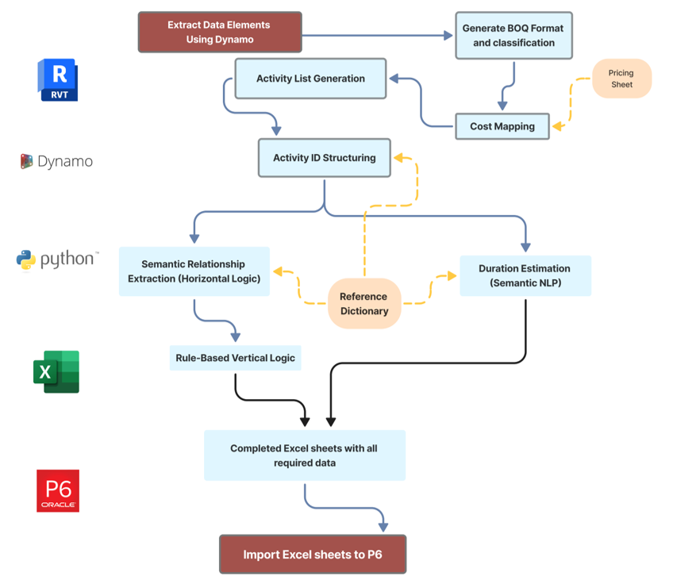

# BIM–NLP Scheduling Framework

An integrated framework for automated construction schedule generation using Building Information Modeling (BIM) and Natural Language Processing (NLP).

---

## 📌 Overview
This project presents a BIM–NLP-based approach for transforming model-derived quantities and textual construction knowledge into a structured and executable project schedule.

The framework integrates:
- BIM data extraction (Autodesk Revit + Dynamo)
- Semantic matching using SBERT
- Rule-based logic generation
- Automated activity creation and sequencing
- Export to Primavera P6

---

## 🚀 Key Features
- Automated activity generation from BIM quantities
- Semantic matching using SBERT embeddings
- Rule-based dependency generation (FS, SS relationships)
- Duration estimation based on productivity data
- Schedule export compatible with Primavera P6

---

## 🧠 Methodology
The workflow includes:
1. BIM data extraction  
2. BOQ transformation  
3. Semantic cost mapping  
4. Activity generation  
5. Duration estimation  
6. Logic generation  
7. Schedule export  

---

## 🛠️ Technologies Used
- Autodesk Revit 2024  
- Dynamo for Revit  
- Python 3.13  
- Sentence-BERT (SBERT)  
- Microsoft Excel  
- Primavera P6  

---

## 📄 Related Publication
An Integrated BIM–NLP Framework for Design-Informed Automated Construction Schedule Generation  
(Under publication in *Designs*, MDPI)

---

## 🔒 License
This project is provided for **research and educational purposes only**.

Commercial use, distribution, or integration into proprietary systems is strictly prohibited without prior written permission from the author.

---

## 👨‍💻 Author
Mahmoud Donia  
Senior Planning Engineer | BIM & NLP Researcher

---

## 📬 Contact
For collaboration or commercial inquiries, please contact:  
[ Mahmoudaraafat1@gmail.com ]

---

  

*Figure: Proposed BIM–NLP integrated framework for automated schedule generation.*
